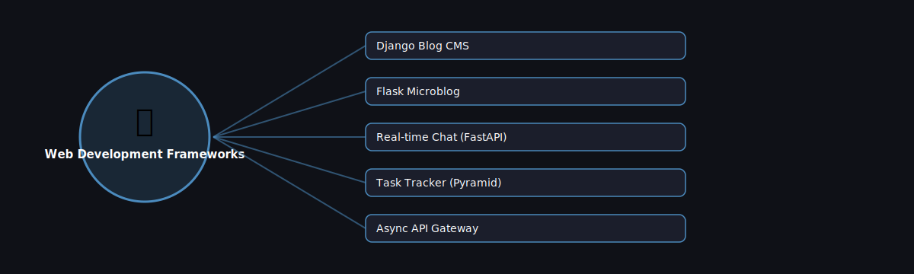

# 🌐 Web Development Frameworks

  

Projects in this category focus on: **Web Development Frameworks**.

| # | Project | Stack | Difficulty |
|---|---------|-------|------------|
| 1 | [Django Blog CMS](./django-blog-cms) | Django | Intermediate |\n| 2 | [Flask Microblog](./flask-microblog) | Flask | Beginner |\n| 3 | [Real-time Chat (FastAPI)](./realtime-chat-fastapi) | FastAPI + WebSockets | Intermediate |\n| 4 | [Task Tracker (Pyramid)](./task-tracker-pyramid) | Pyramid | Intermediate |\n| 5 | [Async API Gateway](./async-api-gateway) | FastAPI + httpx | Advanced |

Pick any project folder above for a full explanation, a flow diagram, and step-by-step build instructions.

---
⬅ Back to [All 100 Projects](../README.md)
