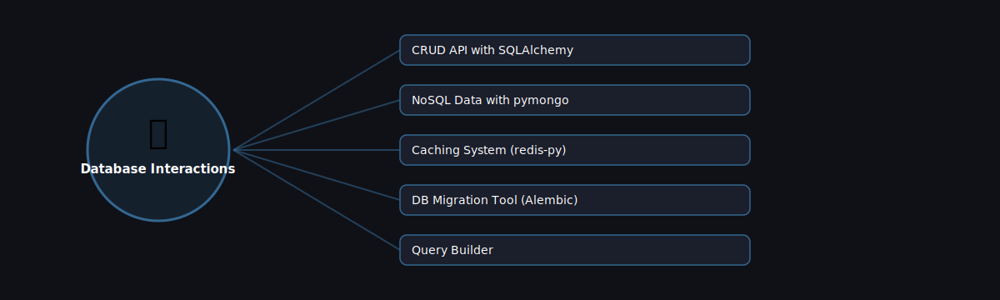

# 🗄️ Database Interactions

  

Projects in this category focus on: **Database Interactions**.

| # | Project | Stack | Difficulty |
|---|---------|-------|------------|
| 1 | [CRUD API with SQLAlchemy](./crud-api-sqlalchemy) | SQLAlchemy + FastAPI | Beginner |\n| 2 | [NoSQL Data with pymongo](./nosql-data-pymongo) | MongoDB + pymongo | Beginner |\n| 3 | [Caching System (redis-py)](./caching-system-redis) | Redis | Intermediate |\n| 4 | [DB Migration Tool (Alembic)](./db-migration-tool-alembic) | Alembic + SQLAlchemy | Intermediate |\n| 5 | [Query Builder](./query-builder) | Pure Python | Advanced |

Pick any project folder above for a full explanation, a flow diagram, and step-by-step build instructions.

---
⬅ Back to [All 100 Projects](../README.md)
