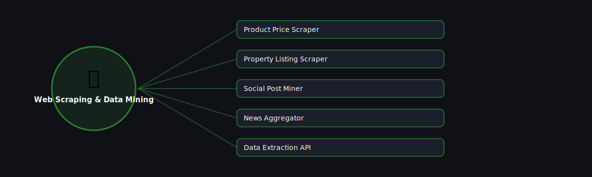

# 🕸️ Web Scraping & Data Mining

  

Projects in this category focus on: **Web Scraping & Data Mining**.

| # | Project | Stack | Difficulty |
|---|---------|-------|------------|
| 1 | [Product Price Scraper](./product-price-scraper) | requests + BeautifulSoup | Beginner |\n| 2 | [Property Listing Scraper](./property-listing-scraper) | Scrapy | Intermediate |\n| 3 | [Social Post Miner](./social-post-miner) | tweepy / snscrape | Intermediate |\n| 4 | [News Aggregator](./news-aggregator) | feedparser + requests | Beginner |\n| 5 | [Data Extraction API](./data-extraction-api) | FastAPI + BeautifulSoup | Advanced |

Pick any project folder above for a full explanation, a flow diagram, and step-by-step build instructions.

---
⬅ Back to [All 100 Projects](../README.md)
