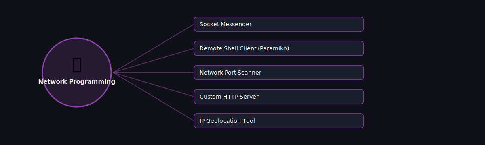

# 🔌 Network Programming

  

Projects in this category focus on: **Network Programming**.

| # | Project | Stack | Difficulty |
|---|---------|-------|------------|
| 1 | [Socket Messenger](./socket-messenger) | socket | Beginner |\n| 2 | [Remote Shell Client (Paramiko)](./remote-shell-client-paramiko) | Paramiko | Intermediate |\n| 3 | [Network Port Scanner](./network-port-scanner) | socket + threading | Beginner |\n| 4 | [Custom HTTP Server](./custom-http-server) | http.server / socket | Intermediate |\n| 5 | [IP Geolocation Tool](./ip-geolocation-tool) | requests | Beginner |

Pick any project folder above for a full explanation, a flow diagram, and step-by-step build instructions.

---
⬅ Back to [All 100 Projects](../README.md)
