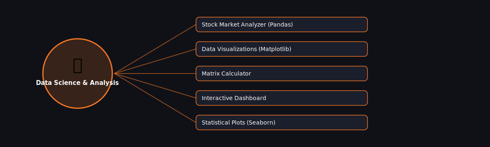

# 📊 Data Science & Analysis

  

Projects in this category focus on: **Data Science & Analysis**.

| # | Project | Stack | Difficulty |
|---|---------|-------|------------|
| 1 | [Stock Market Analyzer (Pandas)](./stock-market-analyzer-pandas) | Pandas | Intermediate |\n| 2 | [Data Visualizations (Matplotlib)](./data-visualizations-matplotlib) | Matplotlib | Beginner |\n| 3 | [Matrix Calculator](./matrix-calculator) | NumPy | Beginner |\n| 4 | [Interactive Dashboard](./interactive-dashboard) | Streamlit | Intermediate |\n| 5 | [Statistical Plots (Seaborn)](./statistical-plots-seaborn) | Seaborn | Beginner |

Pick any project folder above for a full explanation, a flow diagram, and step-by-step build instructions.

---
⬅ Back to [All 100 Projects](../README.md)
