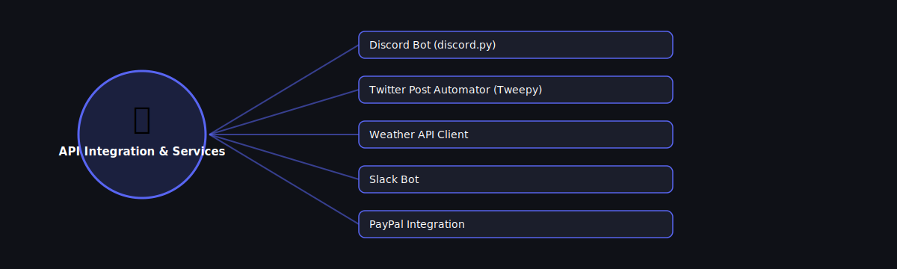

# 🔗 API Integration & Services

  

Projects in this category focus on: **API Integration & Services**.

| # | Project | Stack | Difficulty |
|---|---------|-------|------------|
| 1 | [Discord Bot (discord.py)](./discord-bot-discordpy) | discord.py | Beginner |\n| 2 | [Twitter Post Automator (Tweepy)](./twitter-post-automator-tweepy) | Tweepy | Intermediate |\n| 3 | [Weather API Client](./weather-api-client) | requests | Beginner |\n| 4 | [Slack Bot](./slack-bot) | slack-sdk | Intermediate |\n| 5 | [PayPal Integration](./paypal-integration) | requests / paypal SDK | Advanced |

Pick any project folder above for a full explanation, a flow diagram, and step-by-step build instructions.

---
⬅ Back to [All 100 Projects](../README.md)
