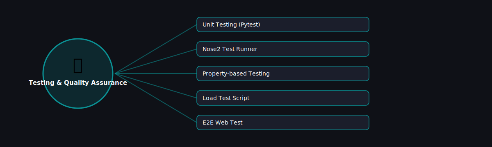

# ✅ Testing & Quality Assurance

  

Projects in this category focus on: **Testing & Quality Assurance**.

| # | Project | Stack | Difficulty |
|---|---------|-------|------------|
| 1 | [Unit Testing (Pytest)](./unit-testing-pytest) | Pytest | Beginner |\n| 2 | [Nose2 Test Runner](./nose2-test-runner) | nose2 | Beginner |\n| 3 | [Property-based Testing](./property-based-testing) | Hypothesis | Advanced |\n| 4 | [Load Test Script](./load-test-script) | Locust | Intermediate |\n| 5 | [E2E Web Test](./e2e-web-test) | Playwright / Selenium | Intermediate |

Pick any project folder above for a full explanation, a flow diagram, and step-by-step build instructions.

---
⬅ Back to [All 100 Projects](../README.md)
