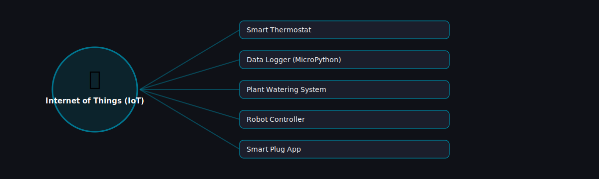

# 📡 Internet of Things (IoT)

  

Projects in this category focus on: **Internet of Things (IoT)**.

| # | Project | Stack | Difficulty |
|---|---------|-------|------------|
| 1 | [Smart Thermostat](./smart-thermostat) | MicroPython + sensor lib | Intermediate |\n| 2 | [Data Logger (MicroPython)](./data-logger-micropython) | MicroPython | Beginner |\n| 3 | [Plant Watering System](./plant-watering-system) | MicroPython | Beginner |\n| 4 | [Robot Controller](./robot-controller) | MicroPython / RPi.GPIO | Intermediate |\n| 5 | [Smart Plug App](./smart-plug-app) | MicroPython + Flask | Beginner |

Pick any project folder above for a full explanation, a flow diagram, and step-by-step build instructions.

---
⬅ Back to [All 100 Projects](../README.md)
