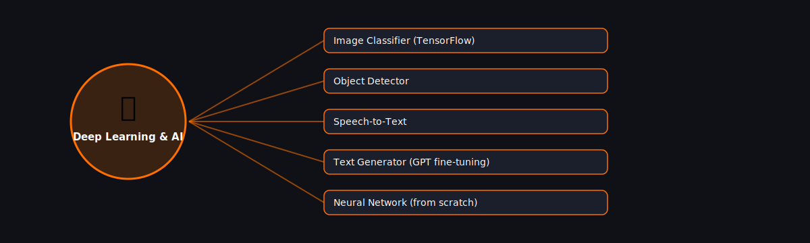

# 🧠 Deep Learning & AI

  

Projects in this category focus on: **Deep Learning & AI**.

| # | Project | Stack | Difficulty |
|---|---------|-------|------------|
| 1 | [Image Classifier (TensorFlow)](./image-classifier-tensorflow) | TensorFlow/Keras | Advanced |\n| 2 | [Object Detector](./object-detector) | YOLO (ultralytics) / OpenCV | Advanced |\n| 3 | [Speech-to-Text](./speech-to-text) | SpeechRecognition / Whisper | Intermediate |\n| 4 | [Text Generator (GPT fine-tuning)](./text-generator-gpt-finetune) | transformers (Hugging Face) | Advanced |\n| 5 | [Neural Network (from scratch)](./neural-network) | NumPy | Advanced |

Pick any project folder above for a full explanation, a flow diagram, and step-by-step build instructions.

---
⬅ Back to [All 100 Projects](../README.md)
