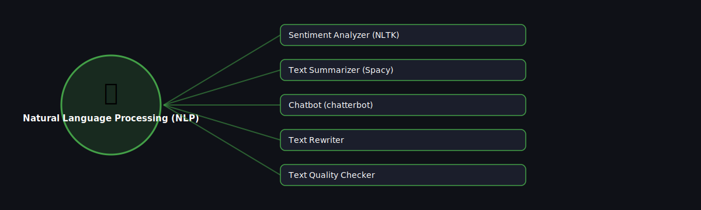

# 💬 Natural Language Processing (NLP)

  

Projects in this category focus on: **Natural Language Processing (NLP)**.

| # | Project | Stack | Difficulty |
|---|---------|-------|------------|
| 1 | [Sentiment Analyzer (NLTK)](./sentiment-analyzer-nltk) | NLTK | Beginner |\n| 2 | [Text Summarizer (Spacy)](./text-summarizer-spacy) | spaCy | Intermediate |\n| 3 | [Chatbot (chatterbot)](./chatbot-chatterbot) | ChatterBot | Beginner |\n| 4 | [Text Rewriter](./text-rewriter) | transformers (paraphrase model) | Intermediate |\n| 5 | [Text Quality Checker](./text-quality-checker) | language_tool_python | Beginner |

Pick any project folder above for a full explanation, a flow diagram, and step-by-step build instructions.

---
⬅ Back to [All 100 Projects](../README.md)
