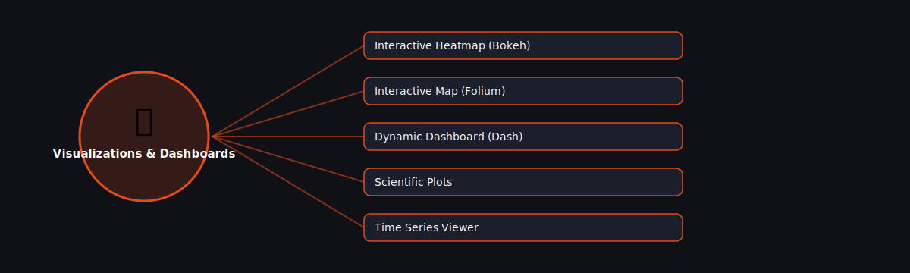

# 📈 Visualizations & Dashboards

  

Projects in this category focus on: **Visualizations & Dashboards**.

| # | Project | Stack | Difficulty |
|---|---------|-------|------------|
| 1 | [Interactive Heatmap (Bokeh)](./interactive-heatmap-bokeh) | Bokeh | Intermediate |\n| 2 | [Interactive Map (Folium)](./interactive-map-folium) | Folium | Beginner |\n| 3 | [Dynamic Dashboard (Dash)](./dynamic-dashboard-dash) | Plotly Dash | Advanced |\n| 4 | [Scientific Plots](./scientific-plots) | Matplotlib + NumPy | Intermediate |\n| 5 | [Time Series Viewer](./time-series-viewer) | Plotly | Intermediate |

Pick any project folder above for a full explanation, a flow diagram, and step-by-step build instructions.

---
⬅ Back to [All 100 Projects](../README.md)
