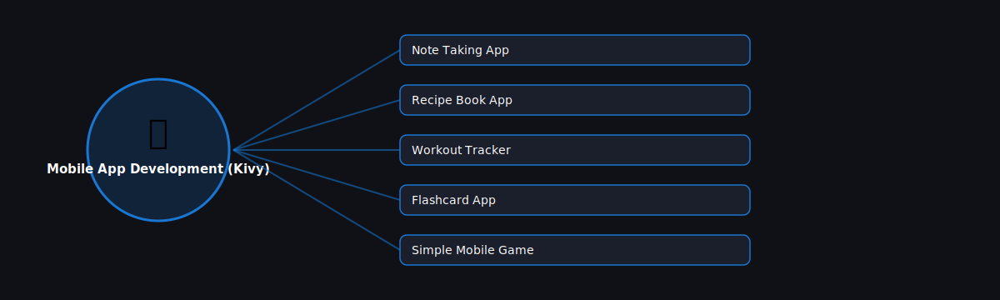

# 📱 Mobile App Development (Kivy)

  

Projects in this category focus on: **Mobile App Development (Kivy)**.

| # | Project | Stack | Difficulty |
|---|---------|-------|------------|
| 1 | [Note Taking App](./note-taking-app) | Kivy | Beginner |\n| 2 | [Recipe Book App](./recipe-book-app) | Kivy | Beginner |\n| 3 | [Workout Tracker](./workout-tracker) | Kivy | Intermediate |\n| 4 | [Flashcard App](./flashcard-app) | Kivy | Beginner |\n| 5 | [Simple Mobile Game](./simple-mobile-game) | Kivy | Intermediate |

Pick any project folder above for a full explanation, a flow diagram, and step-by-step build instructions.

---
⬅ Back to [All 100 Projects](../README.md)
