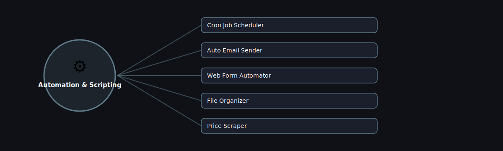

# ⚙️ Automation & Scripting

  

Projects in this category focus on: **Automation & Scripting**.

| # | Project | Stack | Difficulty |
|---|---------|-------|------------|
| 1 | [Cron Job Scheduler](./cron-job-scheduler) | schedule / APScheduler | Beginner |\n| 2 | [Auto Email Sender](./auto-email-sender) | smtplib | Beginner |\n| 3 | [Web Form Automator](./web-form-automator) | Selenium / Playwright | Intermediate |\n| 4 | [File Organizer](./file-organizer) | os / shutil / pathlib | Beginner |\n| 5 | [Price Scraper](./price-scraper) | requests + BeautifulSoup + schedule | Beginner |

Pick any project folder above for a full explanation, a flow diagram, and step-by-step build instructions.

---
⬅ Back to [All 100 Projects](../README.md)
