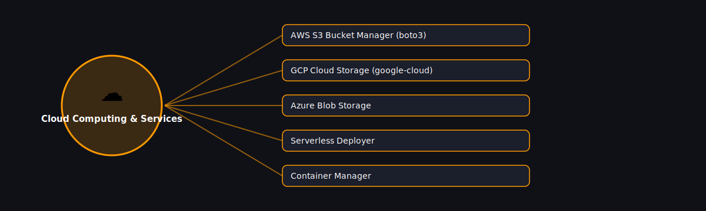

# ☁️ Cloud Computing & Services

  

Projects in this category focus on: **Cloud Computing & Services**.

| # | Project | Stack | Difficulty |
|---|---------|-------|------------|
| 1 | [AWS S3 Bucket Manager (boto3)](./aws-s3-bucket-manager-boto3) | boto3 | Intermediate |\n| 2 | [GCP Cloud Storage (google-cloud)](./gcp-cloud-storage-google-cloud) | google-cloud-storage | Intermediate |\n| 3 | [Azure Blob Storage](./azure-blob-storage) | azure-storage-blob | Intermediate |\n| 4 | [Serverless Deployer](./serverless-deployer) | boto3 / AWS SAM CLI wrapper | Advanced |\n| 5 | [Container Manager](./container-manager) | docker (Python SDK) | Intermediate |

Pick any project folder above for a full explanation, a flow diagram, and step-by-step build instructions.

---
⬅ Back to [All 100 Projects](../README.md)
