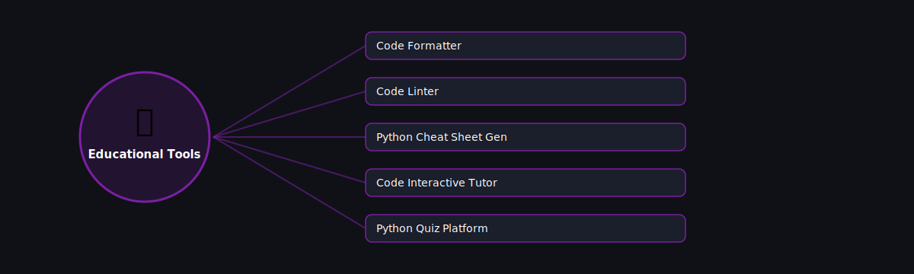

# 🎓 Educational Tools

  

Projects in this category focus on: **Educational Tools**.

| # | Project | Stack | Difficulty |
|---|---------|-------|------------|
| 1 | [Code Formatter](./code-formatter) | tokenize / ast | Advanced |\n| 2 | [Code Linter](./code-linter) | ast | Intermediate |\n| 3 | [Python Cheat Sheet Gen](./python-cheat-sheet-generator) | Jinja2 | Beginner |\n| 4 | [Code Interactive Tutor](./code-interactive-tutor) | exec() sandbox + Flask | Advanced |\n| 5 | [Python Quiz Platform](./python-quiz-platform) | Flask + SQLite | Intermediate |

Pick any project folder above for a full explanation, a flow diagram, and step-by-step build instructions.

---
⬅ Back to [All 100 Projects](../README.md)
