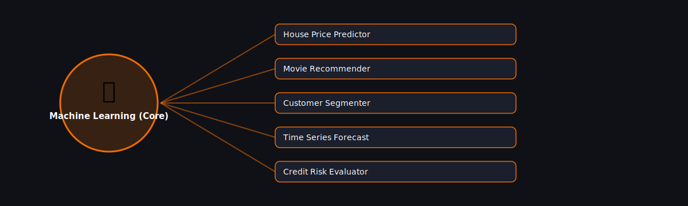

# 🤖 Machine Learning (Core)

  

Projects in this category focus on: **Machine Learning (Core)**.

| # | Project | Stack | Difficulty |
|---|---------|-------|------------|
| 1 | [House Price Predictor](./house-price-predictor) | scikit-learn | Intermediate |\n| 2 | [Movie Recommender](./movie-recommender) | scikit-learn / Surprise | Advanced |\n| 3 | [Customer Segmenter](./customer-segmenter) | scikit-learn | Intermediate |\n| 4 | [Time Series Forecast](./time-series-forecast) | statsmodels / Prophet | Intermediate |\n| 5 | [Credit Risk Evaluator](./credit-risk-evaluator) | scikit-learn | Advanced |

Pick any project folder above for a full explanation, a flow diagram, and step-by-step build instructions.

---
⬅ Back to [All 100 Projects](../README.md)
