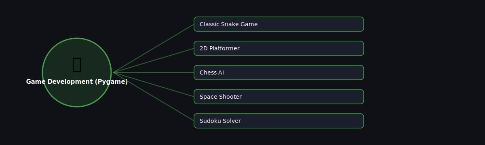

# 🎮 Game Development (Pygame)

  

Projects in this category focus on: **Game Development (Pygame)**.

| # | Project | Stack | Difficulty |
|---|---------|-------|------------|
| 1 | [Classic Snake Game](./classic-snake-game) | Pygame | Beginner |\n| 2 | [2D Platformer](./2d-platformer) | Pygame | Intermediate |\n| 3 | [Chess AI](./chess-ai) | python-chess | Advanced |\n| 4 | [Space Shooter](./space-shooter) | Pygame | Beginner |\n| 5 | [Sudoku Solver](./sudoku-solver) | Pygame + backtracking | Intermediate |

Pick any project folder above for a full explanation, a flow diagram, and step-by-step build instructions.

---
⬅ Back to [All 100 Projects](../README.md)
