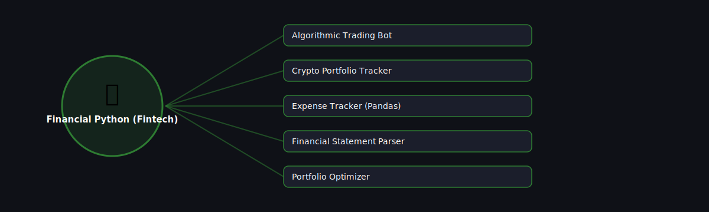

# 💰 Financial Python (Fintech)

  

Projects in this category focus on: **Financial Python (Fintech)**.

| # | Project | Stack | Difficulty |
|---|---------|-------|------------|
| 1 | [Algorithmic Trading Bot](./algorithmic-trading-bot) | pandas + broker API | Advanced |\n| 2 | [Crypto Portfolio Tracker](./crypto-portfolio-tracker) | requests (exchange API) | Beginner |\n| 3 | [Expense Tracker (Pandas)](./expense-tracker-pandas) | Pandas | Beginner |\n| 4 | [Financial Statement Parser](./financial-statement-parser) | pdfplumber / pandas | Intermediate |\n| 5 | [Portfolio Optimizer](./portfolio-optimizer) | NumPy / SciPy / PyPortfolioOpt | Advanced |

Pick any project folder above for a full explanation, a flow diagram, and step-by-step build instructions.

---
⬅ Back to [All 100 Projects](../README.md)
