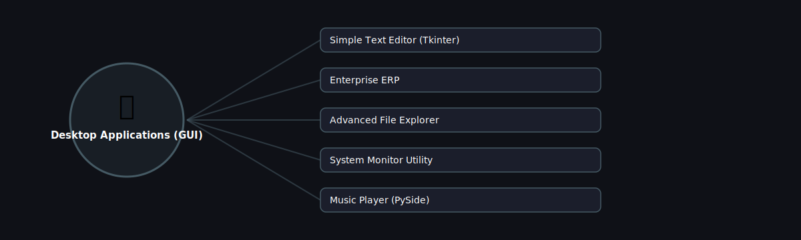

# 🖥️ Desktop Applications (GUI)

  

Projects in this category focus on: **Desktop Applications (GUI)**.

| # | Project | Stack | Difficulty |
|---|---------|-------|------------|
| 1 | [Simple Text Editor (Tkinter)](./simple-text-editor-tkinter) | Tkinter | Beginner |\n| 2 | [Enterprise ERP](./enterprise-erp) | Tkinter/PySide + SQLAlchemy | Advanced |\n| 3 | [Advanced File Explorer](./advanced-file-explorer) | Tkinter/PySide + os | Intermediate |\n| 4 | [System Monitor Utility](./system-monitor-utility) | psutil + Tkinter/PySide | Beginner |\n| 5 | [Music Player (PySide)](./music-player-pyside) | PySide6 + QMediaPlayer | Intermediate |

Pick any project folder above for a full explanation, a flow diagram, and step-by-step build instructions.

---
⬅ Back to [All 100 Projects](../README.md)
