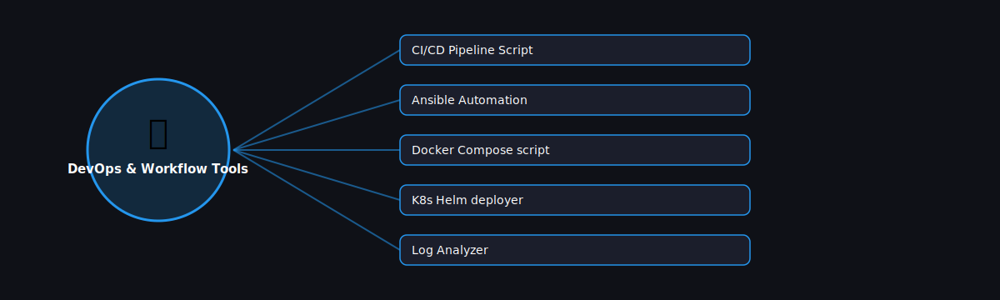

# 🔧 DevOps & Workflow Tools

  

Projects in this category focus on: **DevOps & Workflow Tools**.

| # | Project | Stack | Difficulty |
|---|---------|-------|------------|
| 1 | [CI/CD Pipeline Script](./cicd-pipeline-script) | PyYAML + subprocess | Intermediate |\n| 2 | [Ansible Automation](./ansible-automation) | ansible (Python-based) | Intermediate |\n| 3 | [Docker Compose script](./docker-compose-script) | PyYAML + docker | Intermediate |\n| 4 | [K8s Helm deployer](./k8s-helm-deployer) | subprocess + PyYAML | Advanced |\n| 5 | [Log Analyzer](./log-analyzer) | re + pandas | Intermediate |

Pick any project folder above for a full explanation, a flow diagram, and step-by-step build instructions.

---
⬅ Back to [All 100 Projects](../README.md)
