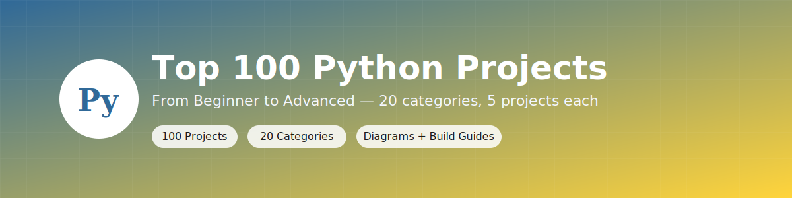
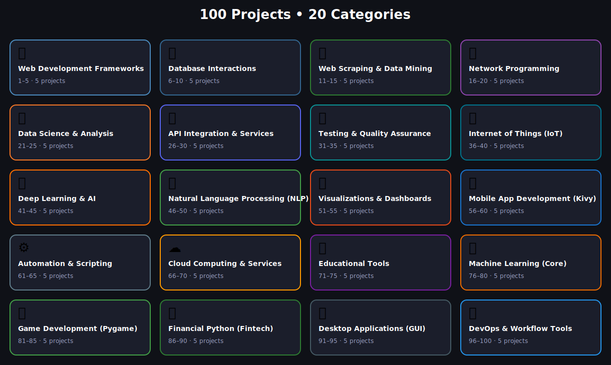

<p align="center">
  
</p>

# 🐍 Top 100 Python Projects (2026)
### From Beginner to Advanced


A structured, hands-on library of **100 Python projects** across **20 real-world categories** — web dev, data science, AI/ML, IoT, games, fintech, DevOps and more. Every single project folder has its own explanation, a flow diagram, a starter scaffold, and step-by-step build instructions.

## 📚 About

This repo is organized the same way a training curriculum would be: pick a category, pick a difficulty, and build. Each of the 100 project folders contains:

```
project-name/
├── README.md          # what it is, diagram, and how to build it
├── starter.py         # a scaffold to build from
└── requirements.txt   # suggested packages to install first
```

## 🗺️ Roadmap

<p align="center">
  
</p>

## 🗂️ Categories & Projects

### 🌐 [Web Development Frameworks](./01-web-development-frameworks)

| Project | Stack | Difficulty |
|---|---|---|
| [Django Blog CMS](./01-web-development-frameworks/django-blog-cms) | Django | Intermediate |
| [Flask Microblog](./01-web-development-frameworks/flask-microblog) | Flask | Beginner |
| [Real-time Chat (FastAPI)](./01-web-development-frameworks/realtime-chat-fastapi) | FastAPI + WebSockets | Intermediate |
| [Task Tracker (Pyramid)](./01-web-development-frameworks/task-tracker-pyramid) | Pyramid | Intermediate |
| [Async API Gateway](./01-web-development-frameworks/async-api-gateway) | FastAPI + httpx | Advanced |

### 🗄️ [Database Interactions](./02-database-interactions)

| Project | Stack | Difficulty |
|---|---|---|
| [CRUD API with SQLAlchemy](./02-database-interactions/crud-api-sqlalchemy) | SQLAlchemy + FastAPI | Beginner |
| [NoSQL Data with pymongo](./02-database-interactions/nosql-data-pymongo) | MongoDB + pymongo | Beginner |
| [Caching System (redis-py)](./02-database-interactions/caching-system-redis) | Redis | Intermediate |
| [DB Migration Tool (Alembic)](./02-database-interactions/db-migration-tool-alembic) | Alembic + SQLAlchemy | Intermediate |
| [Query Builder](./02-database-interactions/query-builder) | Pure Python | Advanced |

### 🕸️ [Web Scraping & Data Mining](./03-web-scraping-data-mining)

| Project | Stack | Difficulty |
|---|---|---|
| [Product Price Scraper](./03-web-scraping-data-mining/product-price-scraper) | requests + BeautifulSoup | Beginner |
| [Property Listing Scraper](./03-web-scraping-data-mining/property-listing-scraper) | Scrapy | Intermediate |
| [Social Post Miner](./03-web-scraping-data-mining/social-post-miner) | tweepy / snscrape | Intermediate |
| [News Aggregator](./03-web-scraping-data-mining/news-aggregator) | feedparser + requests | Beginner |
| [Data Extraction API](./03-web-scraping-data-mining/data-extraction-api) | FastAPI + BeautifulSoup | Advanced |

### 🔌 [Network Programming](./04-network-programming)

| Project | Stack | Difficulty |
|---|---|---|
| [Socket Messenger](./04-network-programming/socket-messenger) | socket | Beginner |
| [Remote Shell Client (Paramiko)](./04-network-programming/remote-shell-client-paramiko) | Paramiko | Intermediate |
| [Network Port Scanner](./04-network-programming/network-port-scanner) | socket + threading | Beginner |
| [Custom HTTP Server](./04-network-programming/custom-http-server) | http.server / socket | Intermediate |
| [IP Geolocation Tool](./04-network-programming/ip-geolocation-tool) | requests | Beginner |

### 📊 [Data Science & Analysis](./05-data-science-analysis)

| Project | Stack | Difficulty |
|---|---|---|
| [Stock Market Analyzer (Pandas)](./05-data-science-analysis/stock-market-analyzer-pandas) | Pandas | Intermediate |
| [Data Visualizations (Matplotlib)](./05-data-science-analysis/data-visualizations-matplotlib) | Matplotlib | Beginner |
| [Matrix Calculator](./05-data-science-analysis/matrix-calculator) | NumPy | Beginner |
| [Interactive Dashboard](./05-data-science-analysis/interactive-dashboard) | Streamlit | Intermediate |
| [Statistical Plots (Seaborn)](./05-data-science-analysis/statistical-plots-seaborn) | Seaborn | Beginner |

### 🔗 [API Integration & Services](./06-api-integration-services)

| Project | Stack | Difficulty |
|---|---|---|
| [Discord Bot (discord.py)](./06-api-integration-services/discord-bot-discordpy) | discord.py | Beginner |
| [Twitter Post Automator (Tweepy)](./06-api-integration-services/twitter-post-automator-tweepy) | Tweepy | Intermediate |
| [Weather API Client](./06-api-integration-services/weather-api-client) | requests | Beginner |
| [Slack Bot](./06-api-integration-services/slack-bot) | slack-sdk | Intermediate |
| [PayPal Integration](./06-api-integration-services/paypal-integration) | requests / paypal SDK | Advanced |

### ✅ [Testing & Quality Assurance](./07-testing-quality-assurance)

| Project | Stack | Difficulty |
|---|---|---|
| [Unit Testing (Pytest)](./07-testing-quality-assurance/unit-testing-pytest) | Pytest | Beginner |
| [Nose2 Test Runner](./07-testing-quality-assurance/nose2-test-runner) | nose2 | Beginner |
| [Property-based Testing](./07-testing-quality-assurance/property-based-testing) | Hypothesis | Advanced |
| [Load Test Script](./07-testing-quality-assurance/load-test-script) | Locust | Intermediate |
| [E2E Web Test](./07-testing-quality-assurance/e2e-web-test) | Playwright / Selenium | Intermediate |

### 📡 [Internet of Things (IoT)](./08-internet-of-things-iot)

| Project | Stack | Difficulty |
|---|---|---|
| [Smart Thermostat](./08-internet-of-things-iot/smart-thermostat) | MicroPython + sensor lib | Intermediate |
| [Data Logger (MicroPython)](./08-internet-of-things-iot/data-logger-micropython) | MicroPython | Beginner |
| [Plant Watering System](./08-internet-of-things-iot/plant-watering-system) | MicroPython | Beginner |
| [Robot Controller](./08-internet-of-things-iot/robot-controller) | MicroPython / RPi.GPIO | Intermediate |
| [Smart Plug App](./08-internet-of-things-iot/smart-plug-app) | MicroPython + Flask | Beginner |

### 🧠 [Deep Learning & AI](./09-deep-learning-ai)

| Project | Stack | Difficulty |
|---|---|---|
| [Image Classifier (TensorFlow)](./09-deep-learning-ai/image-classifier-tensorflow) | TensorFlow/Keras | Advanced |
| [Object Detector](./09-deep-learning-ai/object-detector) | YOLO (ultralytics) / OpenCV | Advanced |
| [Speech-to-Text](./09-deep-learning-ai/speech-to-text) | SpeechRecognition / Whisper | Intermediate |
| [Text Generator (GPT fine-tuning)](./09-deep-learning-ai/text-generator-gpt-finetune) | transformers (Hugging Face) | Advanced |
| [Neural Network (from scratch)](./09-deep-learning-ai/neural-network) | NumPy | Advanced |

### 💬 [Natural Language Processing (NLP)](./10-natural-language-processing-nlp)

| Project | Stack | Difficulty |
|---|---|---|
| [Sentiment Analyzer (NLTK)](./10-natural-language-processing-nlp/sentiment-analyzer-nltk) | NLTK | Beginner |
| [Text Summarizer (Spacy)](./10-natural-language-processing-nlp/text-summarizer-spacy) | spaCy | Intermediate |
| [Chatbot (chatterbot)](./10-natural-language-processing-nlp/chatbot-chatterbot) | ChatterBot | Beginner |
| [Text Rewriter](./10-natural-language-processing-nlp/text-rewriter) | transformers (paraphrase model) | Intermediate |
| [Text Quality Checker](./10-natural-language-processing-nlp/text-quality-checker) | language_tool_python | Beginner |

### 📈 [Visualizations & Dashboards](./11-visualizations-dashboards)

| Project | Stack | Difficulty |
|---|---|---|
| [Interactive Heatmap (Bokeh)](./11-visualizations-dashboards/interactive-heatmap-bokeh) | Bokeh | Intermediate |
| [Interactive Map (Folium)](./11-visualizations-dashboards/interactive-map-folium) | Folium | Beginner |
| [Dynamic Dashboard (Dash)](./11-visualizations-dashboards/dynamic-dashboard-dash) | Plotly Dash | Advanced |
| [Scientific Plots](./11-visualizations-dashboards/scientific-plots) | Matplotlib + NumPy | Intermediate |
| [Time Series Viewer](./11-visualizations-dashboards/time-series-viewer) | Plotly | Intermediate |

### 📱 [Mobile App Development (Kivy)](./12-mobile-app-development-kivy)

| Project | Stack | Difficulty |
|---|---|---|
| [Note Taking App](./12-mobile-app-development-kivy/note-taking-app) | Kivy | Beginner |
| [Recipe Book App](./12-mobile-app-development-kivy/recipe-book-app) | Kivy | Beginner |
| [Workout Tracker](./12-mobile-app-development-kivy/workout-tracker) | Kivy | Intermediate |
| [Flashcard App](./12-mobile-app-development-kivy/flashcard-app) | Kivy | Beginner |
| [Simple Mobile Game](./12-mobile-app-development-kivy/simple-mobile-game) | Kivy | Intermediate |

### ⚙️ [Automation & Scripting](./13-automation-scripting)

| Project | Stack | Difficulty |
|---|---|---|
| [Cron Job Scheduler](./13-automation-scripting/cron-job-scheduler) | schedule / APScheduler | Beginner |
| [Auto Email Sender](./13-automation-scripting/auto-email-sender) | smtplib | Beginner |
| [Web Form Automator](./13-automation-scripting/web-form-automator) | Selenium / Playwright | Intermediate |
| [File Organizer](./13-automation-scripting/file-organizer) | os / shutil / pathlib | Beginner |
| [Price Scraper](./13-automation-scripting/price-scraper) | requests + BeautifulSoup + schedule | Beginner |

### ☁️ [Cloud Computing & Services](./14-cloud-computing-services)

| Project | Stack | Difficulty |
|---|---|---|
| [AWS S3 Bucket Manager (boto3)](./14-cloud-computing-services/aws-s3-bucket-manager-boto3) | boto3 | Intermediate |
| [GCP Cloud Storage (google-cloud)](./14-cloud-computing-services/gcp-cloud-storage-google-cloud) | google-cloud-storage | Intermediate |
| [Azure Blob Storage](./14-cloud-computing-services/azure-blob-storage) | azure-storage-blob | Intermediate |
| [Serverless Deployer](./14-cloud-computing-services/serverless-deployer) | boto3 / AWS SAM CLI wrapper | Advanced |
| [Container Manager](./14-cloud-computing-services/container-manager) | docker (Python SDK) | Intermediate |

### 🎓 [Educational Tools](./15-educational-tools)

| Project | Stack | Difficulty |
|---|---|---|
| [Code Formatter](./15-educational-tools/code-formatter) | tokenize / ast | Advanced |
| [Code Linter](./15-educational-tools/code-linter) | ast | Intermediate |
| [Python Cheat Sheet Gen](./15-educational-tools/python-cheat-sheet-generator) | Jinja2 | Beginner |
| [Code Interactive Tutor](./15-educational-tools/code-interactive-tutor) | exec() sandbox + Flask | Advanced |
| [Python Quiz Platform](./15-educational-tools/python-quiz-platform) | Flask + SQLite | Intermediate |

### 🤖 [Machine Learning (Core)](./16-machine-learning-core)

| Project | Stack | Difficulty |
|---|---|---|
| [House Price Predictor](./16-machine-learning-core/house-price-predictor) | scikit-learn | Intermediate |
| [Movie Recommender](./16-machine-learning-core/movie-recommender) | scikit-learn / Surprise | Advanced |
| [Customer Segmenter](./16-machine-learning-core/customer-segmenter) | scikit-learn | Intermediate |
| [Time Series Forecast](./16-machine-learning-core/time-series-forecast) | statsmodels / Prophet | Intermediate |
| [Credit Risk Evaluator](./16-machine-learning-core/credit-risk-evaluator) | scikit-learn | Advanced |

### 🎮 [Game Development (Pygame)](./17-game-development-pygame)

| Project | Stack | Difficulty |
|---|---|---|
| [Classic Snake Game](./17-game-development-pygame/classic-snake-game) | Pygame | Beginner |
| [2D Platformer](./17-game-development-pygame/2d-platformer) | Pygame | Intermediate |
| [Chess AI](./17-game-development-pygame/chess-ai) | python-chess | Advanced |
| [Space Shooter](./17-game-development-pygame/space-shooter) | Pygame | Beginner |
| [Sudoku Solver](./17-game-development-pygame/sudoku-solver) | Pygame + backtracking | Intermediate |

### 💰 [Financial Python (Fintech)](./18-financial-python-fintech)

| Project | Stack | Difficulty |
|---|---|---|
| [Algorithmic Trading Bot](./18-financial-python-fintech/algorithmic-trading-bot) | pandas + broker API | Advanced |
| [Crypto Portfolio Tracker](./18-financial-python-fintech/crypto-portfolio-tracker) | requests (exchange API) | Beginner |
| [Expense Tracker (Pandas)](./18-financial-python-fintech/expense-tracker-pandas) | Pandas | Beginner |
| [Financial Statement Parser](./18-financial-python-fintech/financial-statement-parser) | pdfplumber / pandas | Intermediate |
| [Portfolio Optimizer](./18-financial-python-fintech/portfolio-optimizer) | NumPy / SciPy / PyPortfolioOpt | Advanced |

### 🖥️ [Desktop Applications (GUI)](./19-desktop-applications-gui)

| Project | Stack | Difficulty |
|---|---|---|
| [Simple Text Editor (Tkinter)](./19-desktop-applications-gui/simple-text-editor-tkinter) | Tkinter | Beginner |
| [Enterprise ERP](./19-desktop-applications-gui/enterprise-erp) | Tkinter/PySide + SQLAlchemy | Advanced |
| [Advanced File Explorer](./19-desktop-applications-gui/advanced-file-explorer) | Tkinter/PySide + os | Intermediate |
| [System Monitor Utility](./19-desktop-applications-gui/system-monitor-utility) | psutil + Tkinter/PySide | Beginner |
| [Music Player (PySide)](./19-desktop-applications-gui/music-player-pyside) | PySide6 + QMediaPlayer | Intermediate |

### 🔧 [DevOps & Workflow Tools](./20-devops-workflow-tools)

| Project | Stack | Difficulty |
|---|---|---|
| [CI/CD Pipeline Script](./20-devops-workflow-tools/cicd-pipeline-script) | PyYAML + subprocess | Intermediate |
| [Ansible Automation](./20-devops-workflow-tools/ansible-automation) | ansible (Python-based) | Intermediate |
| [Docker Compose script](./20-devops-workflow-tools/docker-compose-script) | PyYAML + docker | Intermediate |
| [K8s Helm deployer](./20-devops-workflow-tools/k8s-helm-deployer) | subprocess + PyYAML | Advanced |
| [Log Analyzer](./20-devops-workflow-tools/log-analyzer) | re + pandas | Intermediate |

## 🚀 Getting Started

1. **Clone this repo**
   ```bash
   git clone https://github.com/your-username/top-100-python-projects.git
   cd top-100-python-projects
   ```
2. **Pick a project** and open its folder, e.g.:
   ```bash
   cd 01-web-development-frameworks/flask-microblog
   ```
3. **Install its dependencies**
   ```bash
   python -m venv venv && source venv/bin/activate
   pip install -r requirements.txt
   ```
4. **Read that folder's `README.md`** for the diagram and step-by-step build guide, then build on top of `starter.py`.

## ✅ How to Use This Repo

- **New to Python?** Start with Beginner-tagged projects in *Automation & Scripting*, *Web Scraping*, or *Game Development*.
- **Comfortable with the basics?** Move into *Web Development*, *APIs*, *Data Science*, and *Testing*.
- **Ready for depth?** Tackle *Deep Learning & AI*, *Machine Learning*, *Fintech*, and *DevOps* projects.
- Each project's `starter.py` is intentionally minimal — the value is in following the README's build steps yourself rather than copy-pasting a finished app.

## 🛣️ Suggested Learning Path

| Stage | Categories |
|---|---|
| 1. Foundations | Automation & Scripting, Game Development, Educational Tools |
| 2. Web & Data | Web Development Frameworks, Database Interactions, Web Scraping, Data Science & Analysis |
| 3. Services & Integration | API Integration, Network Programming, Cloud Computing, Testing & QA |
| 4. Applied AI | Machine Learning, NLP, Deep Learning & AI |
| 5. Specialized | IoT, Mobile (Kivy), Desktop GUI, Fintech, Visualizations, DevOps |

## 🤝 Contributing

Found a bug in a build guide, or want to submit your own finished implementation of a project? Open an issue or PR — see [CONTRIBUTING.md](./CONTRIBUTING.md).

## 📄 License

Released under the [MIT License](./LICENSE).

---
<p align="center">100 projects. 20 categories. One repo to level up your Python. 🚀</p>